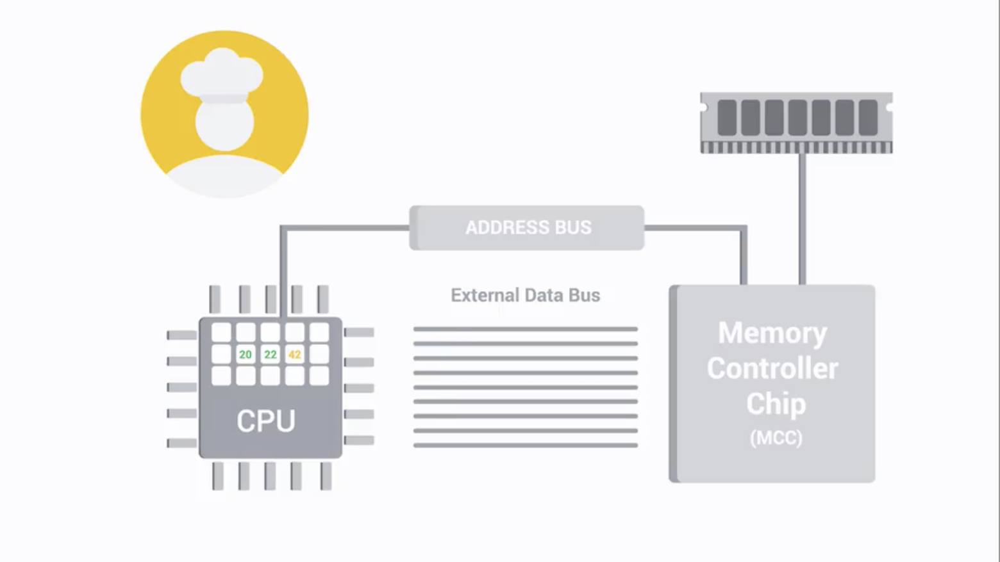

# Hardware

## History of Computing

- Cryptography

  ## Introduction to Computer Hardware

- CPU: central processing unit

- RAM: random access memory(short-term memory)

- Hard Drive

- Motherboard: the body or circulatory system of the computer that connects all the pieces together

## Programs and Hardware

- Program: basic intructions   that tell computer what to do. 
- EDB: 
- MCC: the bridge between CPU and RAM
- Address Bus

+ Cashe
  + L1: smallest and fastest
  + L2: 
  + L3: 

+ Clockwire
  + the Cpu spec like 2.4 Ghz refers to Clock Speed, which means the max number of clock cycles that it can handle in a certain time period.
    2.4 billion cycles per second.
+ Overclocking

## Supplement Reading: CPU Cashe

[link](https://en.wikipedia.org/wiki/CPU_cache)

- def: A CPU cashe is a hardware cache used by the CPU of a computer to reduce the average cost to access data from the main memory. 

### Overview

+ Most modern desktop and server CPUs have at least three independent caches:

  > 1. Instruction cache: speed up executable instrcution fetch.
  > 2. data cash: speed up data tetch and store
  > 3. translation lookaside buffer: speed up virtual-to-physical address translation for both executable instructions and data.

#### Caches entries

+ Data is transferred between memory and cache in blocks of fixed size, called **cache line or cache blocks**.
+ When a cashe line is copied from memory into the cache, a cache entry is created. 
+ cache entry includes:
  the copied data; the requested memory location(tag)

## Supplement Reading: CPU overclock

[link](https://www.digitaltrends.com/computing/how-to-overclock-your-cpu/)

+ How to overclock your CPU

## Components

### CPU

+ It shoud be compatible with the motherboard
  + LGA: land grid array
  + PGA: pin grid array

#### 64-bit computing

+ datapath widths, integer size, memory address widths of 64bits.

### RAM

+ DRAM: dynamic random access memory

+ DIMM: Dual Inline Memory Module 

+ SDRAM(Synchronous DRAM): synchronized to our system's clock speed allowing quicker processing of data. 

+ DDR = doube data SDRAM = DDR SDRAM

  ### Motherboards

+  Peripherals: External devices we connect to our computer, like mouse, keyboard and monitor

+ PCI Express: Peripheral Component Interconnect Express

+ ATX: Advanced Technology eXtended

### Storage

+ HDD
+ SSD

### Power Supplies

+ Two types of electricity
  1. DC: direct current
  2. AC: alternating current

+ Volt, Amps, Wattage
  - Volt: pressure of the electricity. high voltage result in more current of electricity
  - Amps: the amount of electricity coming out as current or amperage. Amps pull as much electricity needed
  - Wattage is the amount of volts and amps that a device needs. 

### Peripherals

+ Anything that you connect to your computer externally that adds functionallity

## Starting It Up

### BIOS

+ Def: Basic Input Output Services    
+ help initialize the hardware in our computer and gets our operating system up and running.
+ Motherboard stores the BIOS in a special type of memory called, the read-only memory chip(ROM chip)
+ UEFI: Unified Extensible Firmware Interface. 
+ POST: power-on self test
+ CMOS battery
+ reimaging: a disk imange which is a copy of an operating system.

### Putting it All together

+ static discharge

# Operating System

## SSH

+ Remote Connection
+ SSH
  + A protocol implemented by other programs to securely access one computer from another
+ VPN
  + Virtual Private Network allows you to connect to a private network like your work network, over the Internet

## Intro to Operating System

+ User Space	
  + Application
+ Kernel Space
  + Process Manager
  + Memory Manager
  + File Manager
  + I/O Manager

## Files and File Systems

+ kernel handle file storage

+ file handling

  1. file system: NTFS(windows), ReFS(new file system), APFS(Mac), ext4(Linux)
  2. storage: data blocks. 

  + block storage improves faster handling of data because the data isn't stored on one long piece and it can be accessed quicker.
  + improves utilizing the storage space. 

  3. metadata(file owner, permissions, filesize, data modified, data created, file type)

## Process Management

+ program: an application that we can rum like Chrome
+ CPU execute processes one by one through something known as a time slice. 
+ Kernel creates processes, efficiently schedules them, and manages how processes are terminated

## Memory Management

### Virtual Memory

+ the combination of hard drive space and RAM that acts like memory that our processes can use

### Swap Space

+ the space in hard drive that is allocated to virtual memory

## I/O Management

### I/O devices

+ Devices that perform input and output

+ When you're troubleshooting or solving a problem with a slow machine, it's usually some sort of hardware resource deficiency

## Interacting with the OS: User Space

+ GUI
+ Shell

