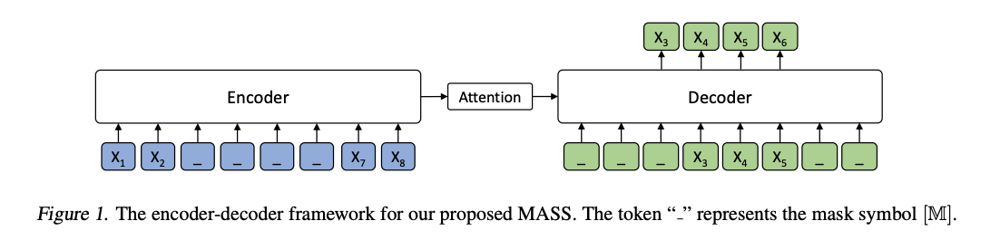

# MASS: Masked Seq to Seq Pre-training for Language Generation

neural machine translation, text summerization, conversational response generation

## Motivation

- BERT is designed for language understanding, which are usually handled by just one encoder or decoder. 
- How to design pre-training methods for the language generation tasks is of great potential and importance.

## MASS training procedure

1. By predicting the fragment of the sentence that is masked on the encoder side, MASS can force the encoder to understand the meaning of the unmasked tokens, in order to predict the masked tokens in the decoder side. 
2. By masking the input tokens of the decoder that are unmasked in the source side, MASS can force the decoder rely more on the source representation otther than the previous tokens in the target side for next token prediction, better facilitating the joint training between encoder and decoder

## Contributions

1. propose MASS
2. sota BLEU score for unsupervised NMT on two language pairs(EN-FR, EN-GE)

## MASS

### Masked Seq to Seq Pre-training

Mass pre-trains a sequence to sequence model by predicting the sentence fragment ***x***[u:v] taking the masked sequence x[\\u:v] 

+ mass is designed to jointly pre-train the encoder and decoder for language generation tasks.

  + Predicting the masked tokens through a sequence to sequence framework, 

    + encoder: understand the meaning of the unmasked tokens
    + decoder: extract useful information from the encoder side. 

  + Predicting consecutive tokens in the decoder side,

    + decoder can build better language modeling capability than just predicting discrete tokens. 

  + masking the input tokens of the decoder which are not masked in the encoder side,

    + decoder is encouraged to extract more useful information from the encoder side, rather than leveraging the abundant information from the previous tokens.

    