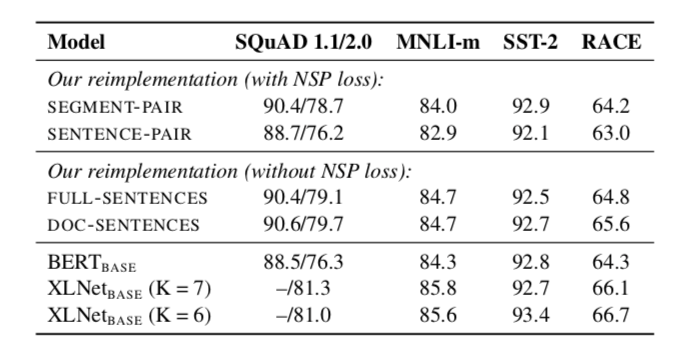
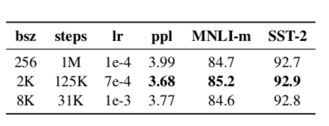
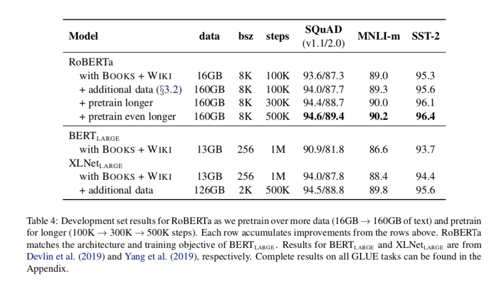

## RoBERTa: A Robustly Optimized BERT Pretraining Approach

+ BERT is significantly undertrained, and can match or exceed the preformance of every model published after it. 

### Modifications that RoBERTa made

1. training the model longer, with bigger batches, over more data
2. removing the next sentence prediction objective
3. training on longer sequences
4. dynamically changing the making pattern applied to the training data

### Contribution of RoBERTa

1. It presents a set of important BERT **design choices and training strategies** and introduce alternatives that lead to better downstream task performance
2. novel dataset
3. masked language model pretraining under the right design choices is competitive with all other recently published methods. 

### Training Procedure Analysis

1. Static vs. Dynamic Masking
   + original BERT relies on randomly masking and predicting tokens. 
     masking once during data preprocessing, resulting in a single static mask. 
   + dynamic masking: we generate the masking pattern every time we feed a sequence to the model. 

2.  Model Input Format and NSP

   + removing the NSP loss matches or slightly improves downsream task performance. 

     

3. Training with large batches

   - Training with very large mini-batches can both improve optimization speed and end-task performance when the learning rate is increased appropriately

     

### RoBERTa

1. dynamic masking
2. Full-sentences without NSP(Next Sentence Prediction)
3. large mini-batches
4. a larger byte-level BPE

