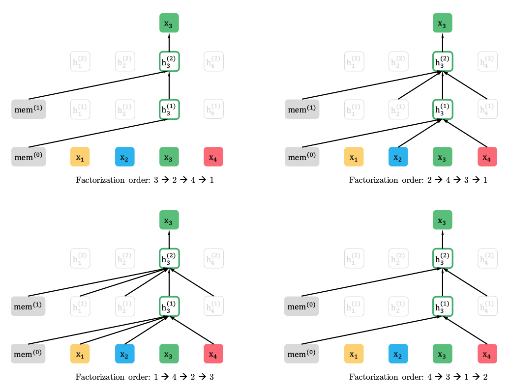
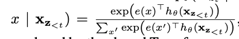
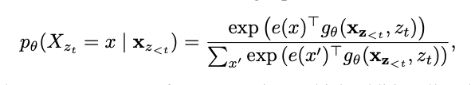
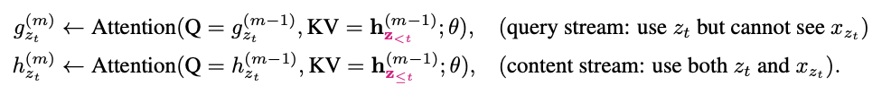
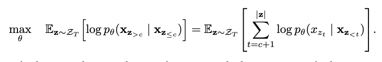
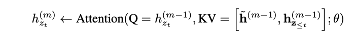
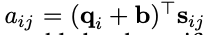

# XLNet: Generalized Autoregressive Pretraining for Language Understanding

+ 기존 모델의 한계
  + 버트는 마스크된 토큰 사이의 의존성을 무시하였음.
  + 사전학습과 fine-tuning 간의 간극이 존재한다

+ XLnet
  + learning Bidirectional contexts by maximizing the expected likelihood over all permutations of the factorization order
  + overcomes the limitation of BERT thanks to its autoregressive formulation
  + TransformerXL 의 아이디어를 사전학습으로 통합시켰다.

+ AR model vs. AE model
  + AR language modeling seeks to estimate the probability distribution of a text corpus with an autoregressive model. 
  + AE based pretraining does not perform explicit density estimation(인풋의 분포를 추정하는 작업) but instead aims to reconstruct the original data from corrupted input. 
    + AR 모델이 unidirectional 하다는 한계를 극복한다
    + 버트의 한계
      + discrepency between pretraining and fine-tuning: 
        [MASK] 와 같은 메타토큰이 실제 테스크에는 등장하지 않는다. 
      + 마스킹된 토큰들 사이의 dependency는 무시된다
+ XLNet
  + maximizes the expected log likelihood of a sequence with respect to all possible permutations of the factorization order. 
  + Does not rely on data corruption. [MASK] 와 같은 메타 토큰이 사용되지 않는다.
  + integrates the segment recurrence mechanism and relative encoding scheme of Transformer-XL
    --> 길이가 긴 문장이 많은 테스크 성능 향상에 도움이 됨
  + reparameterize the Transformer-XL network to remove the ambiguity stemmed from the fact that the factorization order is arbitrary and the target is ambiguous

## Objective

+ permutation language modeling

  + objective

  

  + x[z[t]] : 어떤 permutation Z에서 t번째 토큰
  + x[z[<t]] : 어떤 permutation에서 t-1번째 이전까지의 토큰
  + z[t] 는 일종의 인덱스. t는 한 permutation에서의 인텍스. z[t]는 원래 시퀀스에서에서 그 값이 지니는 인덱스

+ Remark on Permutation

  + the proposed objective only permutes the factorization order, not the sequence order. 

    + we keep the original seq order
    + use the positional encodings corresponding to the original seq
    + rely on a proper attention mask in Transformers to achieve permutation of the factorization order. 

  + this choice is necessary, since the model will only encointer text sequences with the natural order during finetuning. 

    

## Architecture: Two-Stream Self-Attention for Target-Aware Representation

+ standard Transformer Softrmax formulation
  
  + h(x[z[<t]]) : the hidden representation of x[z[<t]] produced by the shared Transformer network after proper masking. 
  + notice that the representation h(x[z[<t]]) does not depend on which position it will predict(the value of z[t])  z[t]를 일종의 인덱스라고 생각해야겠다
    + probelm: the same distribution is predicted regardless of the target position, which is not able to learn useful representation
    + solution: re-parameterize the next-token distribution to be target position aware
      
      + g(x[z[<t]], z[t]) denotes a new type of representations which additionally take the target position z[t] as input  기억하자 z[t]는 원래 시퀀스에서 가지고 있던 인덱스!!

+ Two-Stream self-attention

  + how to formulate g(x[z[:t]], z[t])

    + stand at the target postition z[t] and rely on the postion z[t] to gather information from the context x[z[<t]] through attention

    + **Two requirements** are contradictory (두가지 필요조건이 서로 모순이다)

      1) to predict the token x[z[t]], g(x[z[:t]], z[t]) should only use the position z[t] and not the content x[z[t]]

      2) to predict the other tokens x[z[j]] with j>t, g(x[z[:t]], z[t]) should also encode the content x[z[t]] to provide full contextual information. ??? #TODO

      이해가 가지 않는 부분은 왜 "with j>t" 이면 g(x[z[:j]], z[j]) 여야 하는 거 아닌가? 
      아 알겠다. 트랜스포머의 히든 스테이트는 모두 공유되고 있다. 그래서 지금은 x[z[t]]를 추정할 때는 x[z[t]]를 보면 안되니까 다른 히든 스테이트에도 x[z[t]]의 정보가 없다. 하지만 그 다음 토큰을 추정할 때는 다른 모든 히든 스테이트에 x[z[t]]의 정보가 필요하다. 이를 해결하기 위해 content stream, query stream으로 나눠서 학습을 시키는 것이다!! 베리 굿.

    + **Solution** : two sets of hidden representations

      + the content representation h(x[z[<=t]]), or h[z[t]]

        +  serves a similar role to the standard hidden states in Transformer. This representation encodes both the context and x[z[t]] itself
        + initailized with a trainable vector ***w***	

      + the query representation g(x[z[<t]], z[t]), or g[z[t]]

        +  only has access to the contextual information x[z[<t]] and the position z[t], but not the content x[z[t]] as discussed above.

        + initialized with word embedding h\(0)[i] =e(x[i])

          

  + Partial Prediction 

    + permutation language modeling이 좋긴 하지만 slow convergence가 일어난다
    + we choose to only predict the last token"s" in a factorization order. 각 순열에서 마지막 토큰들만 예측. 
    + split ***z*** into a non-target subsequence, z[<=c], and a target subsequence z[>c] 

    
    + z[>c] is chosen as the target because it possesses the longest context in the sequence given the current factorization order ***z***. 
    + A hyperparameter K: 1/K tokens are selected for predictions

## Incorporateing Ideas from Transformer-XL

+ relative positional encoding
+ segment recurrence mechanism

-  여기서 의문은 K, V 의 경우 concat을 하면 seq_len 이 두배가 됨. Q * K.T 로 attention score를 구하는데 벡터 길이는 어떤 식으로 맞춰주는가.  weight를 곱해서 맞춰주나?  \#TODO  seqence 길이가 늘어나는게 아니라 d_model * 2 되는 것. 
- 위 모델의 장점
  - caching and reusing the momory without knowing the factorization order of the previous segment
  - the model learns to utilize the memory over all factorization orders of the last segment.

## Modeling Multiple Segments

+ input: [A, SEP, B, SEP, CLS]

  + A, B: segments

+ Relative Segment Encoding

  + considered whether the two positions are within the same segment, as opposed to considering which specific segments they are from
  + attention weight

  

  >  s\[i][j]: whether i and j are from the same segment. learnable model parameters for each attention head 
  >
  > q[i]: the query vector as in a standard attention operation
  >
  > b:  a learnable head-specific bias vector

  + the value a\[i][j] is added to the normal attention weight. 

+ benefit

  + the inductive bias of relative encodings improves generalization
  + it opens the possibility of finetuning on tasks that have more than two input segments

## Comparison with BERT

+ in common
  + partial prediction : only predicting a subset of tokens in the sequence.
+ difference
  + the independence assuption disables BERT to model dependency between targets
  + XLNet can capture the dependency between the masked tokens

## Comparison with Language Modeling

+ standard AR language modl like GPT is only able to cover the dependency in a sequential manner
+ ELMo is too shallow to model deep interactions between the two directions

## Bridging the Gap between Language Modeling and Pretraining

+ gap: the lack of the capability of bidirectional context modeling

